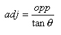

<div align="center">

## Trigonometry Helper


</div>

### Description

The program will provide a fully commented and tutored process of how to use and calculate some basic trigonometry functions.
 
### More Info
 
It's best to have a basic idea of what trig is and how to use sin, cos, tan.


<span>             |<span>
---                |---
**Submitted On**   |2002-06-29 08:59:56
**By**             |[eleet](https://github.com/Planet-Source-Code/PSCIndex/blob/master/ByAuthor/eleet.md)
**Level**          |Intermediate
**User Rating**    |4.7 (14 globes from 3 users)
**Compatibility**  |VB 5\.0, VB 6\.0
**Category**       |[Math/ Dates](https://github.com/Planet-Source-Code/PSCIndex/blob/master/ByCategory/math-dates__1-37.md)
**World**          |[Visual Basic](https://github.com/Planet-Source-Code/PSCIndex/blob/master/ByWorld/visual-basic.md)
**Archive File**   |[Trigonomet1003296302002\_0\-so\.zip](https://github.com/Planet-Source-Code/eleet-trigonometry-helper__1-36406/archive/master.zip)

### API Declarations

```
:====;
:NONE;
:====;
```


